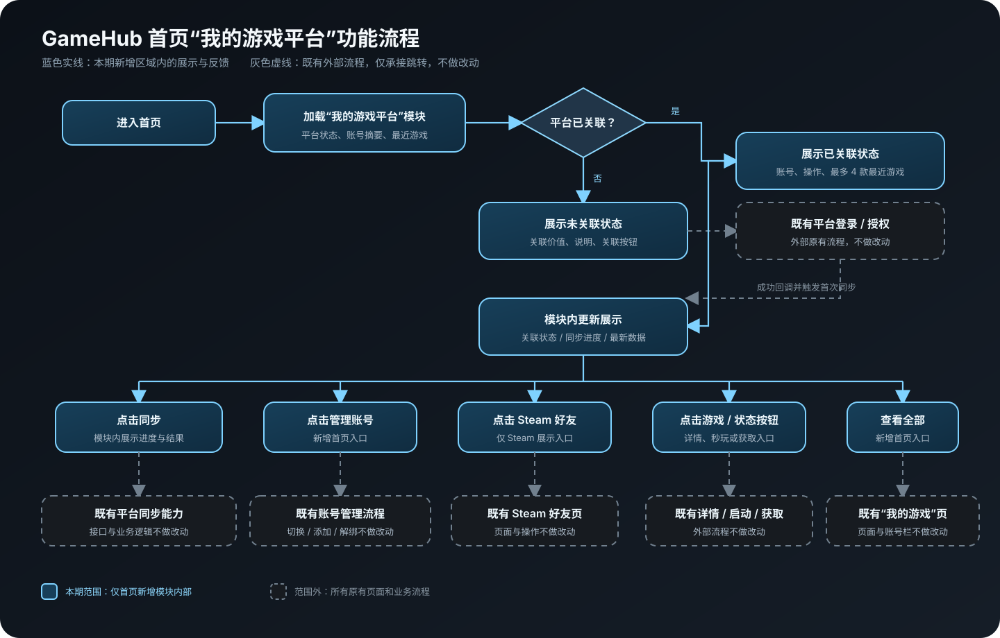

# GameHub 首页“我的游戏平台”模块 PRD

**状态：** 评审稿，待产品 / 设计 / 技术确认  
**版本：** v1.3  
**创建日期：** 2026-08-23  
**最后更新：** 2026-08-25  
**产品负责人：** 待填写  
**设计 / 技术 / 测试负责人：** 待填写  
**计划上线版本：** 待项目评审确认

> **范围声明：本期只调整首页 Hero 与编辑推荐之间新增的“我的游戏平台”区域。登录授权、账号管理、Steam 好友页、我的游戏、游戏详情、秒玩、获取游戏及其他既有页面和业务流程均不做改动。**

---

## 0. 前置假设

- `[假设]` GameHub 已具备 Steam、Epic Games、GOG 的账号关联状态、账号摘要和游戏库数据。
- `[假设]` 三平台登录授权、账号管理、同步、Steam 好友、游戏详情、云游戏启动和获取游戏均为既有能力。
- 本需求只新增首页入口、首页状态展示和首页内的异步反馈；跳出首页新增区域后均进入既有流程。
- 当前没有首页账号入口曝光、关联完成率和游戏操作成功率的正式基线，目标值均为候选值，需数据与产品评审确认。

---

## 1. 文档说明

### 1.1 更新记录

| 版本 | 日期 | 修改内容 | 评审状态 |
|---|---|---|---|
| v1.0 | 2026-08-23 | 整理首页账号关联、最近游戏和游戏入口需求 | 待评审 |
| v1.1 | 2026-08-23 | 补充需求明细、状态异常、数据流和验收标准 | 待评审 |
| v1.2 | 2026-08-25 | 按当前交互设计补充 Steam 好友入口及多平台展示信息 | 待评审 |
| v1.3 | 2026-08-25 | 收口范围：仅保留首页新增模块，所有外部既有流程明确排除在改造范围外 | 待评审 |

### 1.2 变更日志

| 变更对象 | 变更前 | 变更后 | 原因 | 影响范围 |
|---|---|---|---|---|
| 首页平台入口 | 账号入口主要位于【我的游戏】 | 首页新增“我的游戏平台”模块 | 降低平台账号与个人游戏的发现成本 | 仅首页新增区域 |
| 平台状态 | 首页无法直接识别关联情况 | 首页提供 Steam、Epic Games、GOG Tab 和独立关联状态 | 减少跨页面判断 | 仅首页新增区域 |
| 最近游戏 | 首页缺少个人游戏入口 | 当前已关联平台最多展示 4 款最近游戏 | 缩短进入详情和启动路径 | 仅首页新增区域 |
| 平台操作 | 同步、管理入口作用域不清 | 操作固定在当前平台账号摘要中 | 明确操作对象 | 仅首页新增区域 |
| Steam 好友 | 首页没有好友快捷入口 | Steam 已关联时展示好友在线数 / 总数入口 | 缩短进入好友页路径 | 仅首页新增区域；好友页不改 |

### 1.3 名词术语

| 术语 | 定义 |
|---|---|
| 关联平台 | 用户已通过既有授权流程连接到 GameHub 的第三方游戏平台 |
| 当前平台 | 用户在首页模块中当前选中的 Steam、Epic Games 或 GOG Tab |
| 最近游戏 | 当前平台下按最终确认排序规则展示的最多 4 款游戏 |
| 秒玩 | 游戏支持既有云游戏能力时展示的启动入口 |
| 获取游戏 | 当前不能直接秒玩时，进入既有获取或下载承接流程的入口 |
| 同步 | 调用既有平台同步能力，并在首页模块内展示进度与结果 |
| 管理账号 | 从首页打开当前平台既有账号管理流程；内部能力不在本期改造 |
| Steam 好友入口 | 仅 Steam 已关联且好友能力可用时展示，点击进入既有 Steam 好友页 |

### 1.4 相关交付

| 里程碑 | 输出 | 负责人 | 时间 | 状态 |
|---|---|---|---|---|
| 产品评审 | PRD v1.3、交互设计 | 产品 | 待确认 | 进行中 |
| 视觉定稿 | 首页新增模块视觉与响应式规格 | 设计 | 待确认 | 未开始 |
| 技术评审 | 数据字段、接口复用、状态与异常方案 | 技术 | 待确认 | 未开始 |
| 开发联调 | 首页模块及既有流程入口接入 | 客户端 / 服务端 | 待确认 | 未开始 |
| 测试验收 | 首页功能、状态、异常与外部流程回归 | 测试 | 待确认 | 未开始 |

---

## 2. 背景与目标

### 2.1 背景

GameHub 已支持关联 Steam、Epic Games 和 GOG，但用户进入首页时主要看到推荐内容，无法直接知道自己关联了哪些平台、当前平台有哪些个人游戏，以及游戏能够秒玩还是需要获取。

现有登录、授权、账号管理、好友、游戏库、详情和启动流程已经存在。本期不重做这些流程，只在首页增加统一入口和状态摘要。

### 2.2 问题陈述

拥有第三方游戏库的用户在首页无法快速识别平台关联状态和个人游戏能力，需要进入更深页面后才能完成判断和操作。

### 2.3 目标与候选指标

| 目标 | 指标 | 候选目标 | 观察周期 |
|---|---|---:|---|
| 用户能发现平台账号模块 | 模块有效曝光率 | ≥ 90% `[假设]` | 上线后 2 周 |
| 用户能进入关联流程 | 首页关联入口点击率 | ≥ 8% `[假设]` | 上线后 4 周 |
| 关联流程能够完成 | 首页来源关联完成率 | ≥ 65% `[假设]` | 上线后 4 周 |
| 游戏入口可正常承接 | 秒玩 / 获取 / 详情进入下一流程成功率 | ≥ 95% `[假设]` | 上线后 2 周 |
| Steam 好友入口可正常承接 | 好友入口进入既有好友页成功率 | ≥ 98% `[假设]` | 上线后 2 周 |
| 不明显损害推荐浏览 | 编辑推荐点击率相对变化 | 下降不超过 2% `[假设]` | 上线后 4 周 |

### 2.4 非目标

- 不修改首页 Hero、编辑推荐及其他首页区域。
- 不修改全局侧栏导航和个人中心。
- 不修改 Steam、Epic Games、GOG 的登录、授权和回调逻辑。
- 不修改账号管理中的添加、切换、解绑和权限逻辑。
- 不修改 Steam 好友页及其搜索、添加、聊天和更多操作。
- 不修改【我的游戏】页面、右侧平台账号栏、筛选、搜索、游戏列表和下载逻辑。
- 不修改游戏详情页、媒体列表、兼容性详情和返回逻辑。
- 不修改云游戏启动、本地启动、获取游戏和下载任务流程。
- 不处理跨平台同款游戏合并、跨平台存档同步和推荐算法。

---

## 3. 产品方案

### 3.1 产品概念

在首页 Hero 与编辑推荐之间新增“我的游戏平台”模块。用户可切换 Steam、Epic Games、GOG：未关联时看到关联价值和入口；已关联时看到账号摘要、平台操作、最近游戏和对应动作；Steam 额外展示好友入口。所有跨页面操作均进入既有流程。

### 3.2 功能结构

```text
首页
└── 我的游戏平台（本期新增）
    ├── 平台 Tab 与关联状态
    ├── 未关联状态
    │   ├── 关联价值说明
    │   ├── 关联平台入口 → 既有登录 / 授权
    │   └── 关联前说明
    └── 已关联状态
        ├── 账号摘要
        ├── Steam 好友入口 → 既有好友页
        ├── 同步入口 → 既有同步能力
        ├── 管理账号入口 → 既有账号管理
        ├── 最近游戏（最多 4 款）
        │   ├── 封面 / 名称 → 既有游戏详情
        │   ├── 秒玩 → 既有云游戏流程
        │   └── 获取游戏 → 既有获取流程
        └── 查看全部 → 既有“我的游戏”页
```

### 3.3 信息结构

| 对象 | 首页展示字段 | 规则 |
|---|---|---|
| 平台 | 平台 ID、名称、Icon、关联状态 | Steam / Epic Games / GOG 独立维护状态 |
| 账号 | 昵称、平台账号 ID、游戏数量、在线或关联状态 | 不展示邮箱、令牌和授权凭据 |
| Steam 好友 | 在线好友数、好友总数 | 仅 Steam 且好友能力可用时展示 |
| 游戏 | 游戏 ID、名称、封面、所属平台 | 当前平台最多 4 款 |
| 游戏能力 | 云游戏可用、获取入口 | 决定“秒玩”或“获取游戏” |
| 同步任务 | 阶段、已处理数量、总数、百分比、结果 | 进度值 0–100，仅作用于当前平台 |

### 3.4 Feature List

| 编号 | 功能 | 性质 | 优先级 | 依赖 |
|---|---|---|---|---|
| F-01 | 首页游戏平台模块 | 新增 | P0 | 首页布局 |
| F-02 | 平台 Tab 与独立状态 | 新增 | P0 | 平台关联数据 |
| F-03 | 已关联账号摘要 | 新增 | P0 | 平台账号数据 |
| F-04 | 未关联平台状态 | 新增 | P0 | 既有登录授权 |
| F-05 | 最近游戏列表 | 新增 | P0 | 游戏库与排序数据 |
| F-06 | 秒玩 / 获取游戏入口 | 新增入口 | P0 | 游戏能力判断 |
| F-07 | 游戏详情入口 | 新增入口 | P0 | 既有游戏详情 |
| F-08 | 查看全部入口 | 新增入口 | P0 | 既有“我的游戏”页 |
| F-09 | 平台同步与进度 | 新增入口与反馈 | P0 | 既有同步能力 |
| F-10 | 管理账号入口 | 新增入口 | P0 | 既有账号管理 |
| F-11 | Steam 好友入口 | 新增入口 | P1 | 既有 Steam 好友页 |

---

## 4. 功能流程



> 蓝色实线节点为本期首页新增区域；灰色虚线节点为既有外部流程，只承接跳转，不做改动。

---

## 5. 全局规则

### 5.1 数据与权限

- 平台关联状态、授权状态和账号数据由既有平台能力返回，首页不自行推断。
- Steam 好友入口只在 Steam 已关联且好友能力可用时展示。
- 同步、管理操作只在当前平台已关联且具备权限时可执行。
- 授权失效时保留上次成功数据，并显示重新关联入口，不得表现为正常在线。
- 登录凭据、验证码、令牌、邮箱和授权范围明细不得进入首页展示或日志。

### 5.2 交互

- 平台 Tab 支持点击和左右方向键切换。
- 切换平台后，账号、好友入口、游戏和操作必须整体更新，不得串用其他平台数据。
- 封面/名称与秒玩/获取按钮为独立点击区域，不能相互触发。
- 异步操作必须立即反馈，禁止静默等待。
- 调用外部既有流程时携带平台 ID、游戏 ID 和来源页；返回后保留首页当前平台状态。

### 5.3 字段与展示

| 字段 | 规则 |
|---|---|
| 账号昵称 | 单行展示，超长截断；完整值通过可访问名称或提示读取 |
| 平台账号 ID | 单行展示，不换行挤压操作区域 |
| 游戏数量 | 使用“X 款游戏”；未知时不显示错误的 0 |
| Steam 好友数量 | 使用“在线数 / 总数”；任一数据未知时隐藏数量或显示可恢复状态 |
| 最近游戏 | 最多 4 款；排序规则由产品和数据确认 |
| 游戏名称 | 单行截断；封面和名称命中同一游戏对象 |
| 游戏状态按钮 | 依据能力结果显示“秒玩”或“获取游戏”，不得按平台名称硬编码 |
| 同步进度 | 展示阶段、处理数量和百分比，数值范围 0–100 |

---

## 6. 需求说明

### 6.1 需求列表

| 需求编号 | 模块 | 要求 | 优先级 |
|---|---|---|---|
| REQ-01 | 模块位置 | 位于 Hero 与编辑推荐之间，不改动其他首页区域 | P0 |
| REQ-02 | 平台 Tab | 三个平台独立维护关联状态并支持键盘切换 | P0 |
| REQ-03 | 已关联账号摘要 | 展示账号、游戏数量、状态和当前平台操作 | P0 |
| REQ-04 | 未关联平台状态 | 展示关联价值、关联入口和关联前说明 | P0 |
| REQ-05 | 最近游戏 | 当前平台最多展示 4 款最近游戏 | P0 |
| REQ-06 | 游戏详情入口 | 封面和名称进入既有详情页 | P0 |
| REQ-07 | 秒玩 / 获取游戏 | 按游戏能力进入对应既有流程 | P0 |
| REQ-08 | 查看全部 | 进入既有【我的游戏】并传递当前平台 | P0 |
| REQ-09 | 同步 | 只同步当前平台，并在模块内展示进度和结果 | P0 |
| REQ-10 | 管理账号 | 打开当前平台既有账号管理流程 | P0 |
| REQ-11 | Steam 好友入口 | 展示在线/总数并进入既有 Steam 好友页 | P1 |

### 6.2 需求明细

| 功能名称 | 触发条件 | 输入数据 | 处理逻辑 | 错误与恢复 | 核心测试 | 效能标准 |
|---|---|---|---|---|---|---|
| 模块位置 | 首页加载完成 | 无 | 在 Hero 与编辑推荐之间插入模块；不改变其他首页区域 | 模块失败不阻塞 Hero 和编辑推荐，显示可重试空态 | 正向：模块完整；逆向：数据失败；边界：最小窗口 | 不阻塞 Hero 首屏；阈值待技术确认 |
| 平台 Tab 与状态 | 点击 Tab 或左右方向键 | 平台 ID、关联状态 | 三个平台独立维护状态；切换只更新模块内容 | 状态缺失显示待重试，不沿用其他平台数据 | 三平台切换、快速切换、状态请求失败 | 点击后立即出现选中反馈 |
| 已关联账号摘要 | 当前平台已关联 | 昵称、账号 ID、游戏数量、状态 | 展示当前平台账号摘要；同步和管理固定在摘要内 | 字段缺失时隐藏对应字段，不显示错误的 0 | 字段完整、部分缺失、超长文本 | 数据出现时间待技术确认 |
| 未关联平台状态 | 当前平台未关联 | 平台 ID、平台名称 | 展示关联价值、关联按钮和关联前说明；点击进入既有登录授权 | 取消或失败保持未关联；成功后返回当前 Tab 并首次同步 | 成功、取消、失败、回调超时、重复点击 | 登录标准沿用既有流程 |
| 最近游戏列表 | 游戏库加载完成 | 游戏 ID、名称、封面、活动时间、能力状态 | 当前平台最多展示 4 款；按确认规则排序 | 空列表显示空态；封面失败显示占位；排序字段缺失按约定兜底 | 0–4 款、超过 4 款、图片失败、同时间数据 | 首批数据和图片阈值待确认 |
| 游戏详情入口 | 点击封面或名称 | 游戏 ID、平台 ID、来源页 | 两处进入同一既有游戏详情，并携带来源信息 | 游戏失效或目标页失败时留在首页并提示重试 | 封面/名称一致、游戏不存在、重复点击 | 点击后立即反馈 |
| 秒玩 / 获取游戏 | 点击状态按钮 | 游戏 ID、平台、能力状态 | 支持云游戏显示“秒玩”，否则显示“获取游戏”；进入对应既有流程 | 能力未知时按钮不可执行并说明原因；失败时提供重试或替代路径 | 秒玩、获取、能力失败、状态变化 | 进入下一流程成功率候选 ≥95% |
| 查看全部 | 点击“查看全部” | 当前平台 ID、游戏数量、来源页 | 进入既有【我的游戏】并带入当前平台上下文 | 目标页失败时留在首页并提示重试 | 正常进入、平台失效、目标页失败 | 点击后立即反馈 |
| 同步与进度 | 点击当前平台同步 | 平台 ID、授权状态、任务进度 | 调用既有同步能力；模块内显示阶段、处理数量、进度和结果；同步中禁用重复点击 | 授权失效提示重新关联；失败保留上次数据并允许重试 | 成功、失败、中断、重复点击、进度回退 | 不创建重复任务；更新频率待确认 |
| 管理账号入口 | 点击当前平台管理 | 平台 ID、来源页 | 打开既有账号管理流程；本期不改变其内部逻辑 | 打开失败提示重试；关闭后首页状态不变 | 打开、关闭、选择、添加、失败 | 入口立即反馈，内部沿用既有标准 |
| Steam 好友入口 | Steam 已关联且好友能力可用 | Steam 账号 ID、在线数、总数、来源页 | 展示“好友列表 在线数 / 总数”；点击进入既有好友页 | 数据失败时隐藏数量或入口；目标页失败时保留首页状态并提示重试 | 可见性、0 好友、数据失败、Epic/GOG 不显示、返回状态 | 进入好友页成功率候选 ≥98% |

### 6.3 状态与异常

| 状态 | 首页模块表现 | 用户操作 | 恢复结果 |
|---|---|---|---|
| 全部未关联 | 当前平台展示关联价值和入口 | 切换平台、查看说明、关联 | 进入既有登录流程 |
| 部分关联 | 已关联平台显示账号和游戏，未关联平台显示关联状态 | 切换平台 | 各平台状态互不影响 |
| 全部已关联 | 三个平台均可查看账号摘要和最近游戏 | 切换、同步、管理、游戏操作 | 操作只作用于当前平台 |
| 授权失效 | 保留上次数据，显示重新关联 | 重新关联 | 成功后恢复同步能力 |
| 同步中 | 当前平台按钮禁用，显示进度 | 等待 | 成功后更新数据并收起进度 |
| 同步失败 | 保留上次数据，显示失败和重试 | 重试 | 重新发起当前平台同步 |
| 游戏列表为空 | 保留账号摘要，游戏区显示空态 | 同步或查看全部 | 数据恢复后展示游戏 |
| 游戏能力未知 | 操作按钮禁用并说明原因 | 重试 | 能力恢复后展示正确按钮 |
| Steam 好友不可用 | 隐藏好友入口或显示可恢复状态 | 重试 / 同步 | 恢复后展示入口 |

### 6.4 非功能需求

- **性能：** 首页新增模块不得阻塞 Hero 首屏；平台切换和按钮点击需立即出现视觉反馈。
- **安全与隐私：** 不记录或展示平台密码、验证码、令牌、邮箱和完整授权信息。
- **可访问性：** Tab、按钮和状态支持键盘；焦点清晰；Icon 具备可读名称；颜色不是唯一状态信号。
- **兼容性：** 正式 App 最小窗口规格待确认；窗口缩小时优先保留账号、操作和前两款游戏。
- **稳定性：** 登录、同步和外部流程失败不得破坏上次成功账号与游戏数据。

### 6.5 数据与埋点建议

| 事件 | 触发时机 | 建议参数 |
|---|---|---|
| home_platform_module_expose | 模块达到可见阈值 | 默认平台、三平台关联状态、窗口尺寸 |
| home_platform_tab_click | 切换平台 | 平台、关联状态、来源页 |
| home_platform_connect_click | 点击关联 | 平台、结果、错误码 |
| home_platform_guide_click | 点击关联前说明 | 平台 |
| home_platform_sync_click | 点击同步 | 平台、上次同步时间、结果、耗时、错误码 |
| home_platform_manage_click | 点击管理 | 平台、结果 |
| home_game_detail_click | 点击封面或名称 | 平台、游戏 ID、入口类型 |
| home_game_action_click | 点击秒玩或获取 | 平台、游戏 ID、操作类型、结果 |
| home_view_all_click | 点击查看全部 | 平台、游戏数量 |
| home_steam_friend_click | 点击 Steam 好友入口 | 在线数、总数、结果；不得记录好友名单 |

---

## 7. 验收标准

| 编号 | 前置条件 | 操作 | 预期结果 |
|---|---|---|---|
| AC-01 | 打开首页 | 查看 Hero 与编辑推荐之间 | 显示完整“我的游戏平台”模块，其他首页区域不变 |
| AC-02 | 三个平台状态已返回 | 点击或键盘切换 Tab | 账号、好友入口、游戏和操作整体切换，状态互不串联 |
| AC-03 | 当前平台已关联 | 查看账号摘要 | 昵称、ID、游戏数量和状态可读，同步与管理位于当前平台摘要内 |
| AC-04 | 当前平台未关联 | 查看模块 | 展示关联价值、关联按钮和关联前说明，不显示已关联数据 |
| AC-05 | 未关联平台 | 取消或关联失败 | 返回首页后保留当前 Tab 和未关联状态 |
| AC-06 | 未关联平台 | 关联成功 | 当前平台变为已关联并触发首次同步 |
| AC-07 | 当前平台存在游戏 | 查看最近游戏 | 最多展示 4 款且顺序稳定 |
| AC-08 | 点击游戏封面或名称 | 进入详情 | 两处进入同一既有详情，并携带正确游戏和来源信息 |
| AC-09 | 游戏支持云游戏 | 点击状态按钮 | 显示“秒玩”并进入既有云游戏流程 |
| AC-10 | 游戏不支持云游戏 | 点击状态按钮 | 显示“获取游戏”并进入既有获取流程 |
| AC-11 | 当前平台已关联 | 点击查看全部 | 进入既有【我的游戏】并带入当前平台上下文 |
| AC-12 | 当前平台已关联 | 点击同步 | 只同步当前平台，并展示阶段、数量、进度和百分比 |
| AC-13 | 同步进行中 | 再次点击同步 | 按钮禁用，不创建重复任务 |
| AC-14 | 同步失败 | 点击重试 | 保留上次数据并重新发起当前平台同步 |
| AC-15 | 当前平台已关联 | 点击管理账号 | 打开当前平台既有账号管理流程，关闭后首页状态不变 |
| AC-16 | Steam 已关联且好友可用 | 查看并点击好友列表 | 展示在线/总数并进入既有 Steam 好友页 |
| AC-17 | 当前平台为 Epic Games 或 GOG | 查看账号摘要 | 不展示 Steam 好友入口 |
| AC-18 | 完成首页功能验收 | 回归所有外部承接流程 | 登录、账号管理、好友页、我的游戏、详情、秒玩和获取流程均未发生业务变化 |

---

## 8. 风险与依赖

| 类型 | 内容 | 影响 | 处理方式 |
|---|---|---|---|
| 依赖 | 三平台关联状态、账号和游戏库接口 | 决定首页数据可用性 | 复用既有能力并统一状态码 |
| 依赖 | 既有同步任务进度 | 决定模块进度反馈 | 技术确认任务 ID、阶段、总数和失败码 |
| 依赖 | 游戏能力判断 | 决定秒玩或获取入口 | 展示前获取能力并定义缓存与失败策略 |
| 依赖 | Steam 好友统计 | 决定好友入口可用性 | 确认在线数、总数、刷新频率和隐私口径 |
| 风险 | 首页信息量增加 | 可能影响推荐浏览 | 限制模块高度和游戏数量，观察护栏指标 |
| 风险 | 三平台字段不一致 | 切换后出现字段错位或错误状态 | 使用统一字段规则，不支持字段隐藏 |
| 风险 | 外部流程被误纳入本期 | 范围膨胀、重复开发 | 技术方案和测试用例明确“仅入口承接，不改原流程” |

---

## 9. 待确认事项

| 编号 | 问题 | 负责人 | 最晚时间 |
|---|---|---|---|
| Q-01 | 最近游戏按最近游玩、最近同步还是综合活动时间排序 | 产品 / 数据 | 产品评审前 |
| Q-02 | 默认平台使用固定 Steam、上次选择还是优先已关联平台 | 产品 | 产品评审前 |
| Q-03 | “获取游戏”最终进入商店详情、我的游戏定位还是下载确认 | 产品 / 技术 | 交互评审前 |
| Q-04 | 首页模块最小窗口下保留几款游戏 | 产品 / 设计 | 视觉评审前 |
| Q-05 | Steam 好友在线数 / 总数的刷新频率和失败表现 | 产品 / 技术 | 技术评审前 |
| Q-06 | 关联成功后首次同步是否自动触发及超时阈值 | 产品 / 技术 | 技术评审前 |
| Q-07 | 指标基线、最终目标值和观察周期 | 产品 / 数据 | 上线前 |

---

## 10. 相关交互设计

- 当前交互设计：`GameHub-首页原型-压缩兼容版.html`
- 功能流程图（PNG）：`flow.svg`
- 功能流程图（SVG）：`assets/GameHub-首页游戏平台模块-功能流程-v1.3.svg`

> 交互设计仅用于展示本 PRD 中的首页新增区域。设计中出现的其他页面和流程均为既有能力示意，不属于本期需求范围。

### 待插入截图

1. `[待产品插图]` 首页—Steam 已关联状态
2. `[待产品插图]` 首页—Epic Games / GOG 未关联状态
3. `[待产品插图]` 首页—同步进度状态
4. `[待产品插图]` 首页—管理账号入口
5. `[待产品插图]` 首页—Steam 好友入口

---

## 11. 项目规划

1. 产品确认 PRD、范围边界、待确认事项和指标口径。
2. 设计完成首页新增模块的视觉与响应式规格，不改外部页面。
3. 技术确认平台数据、同步进度、能力判断和外部入口的复用方式。
4. 产品、设计、技术、测试联合评审首页状态矩阵和异常恢复。
5. 开发完成后按 AC-01～AC-18 验收。
6. 对登录、账号管理、Steam 好友页、我的游戏、游戏详情、秒玩和获取流程执行回归测试，确认无业务变化。
7. 上线前确认埋点、监控、灰度和回滚方案。
